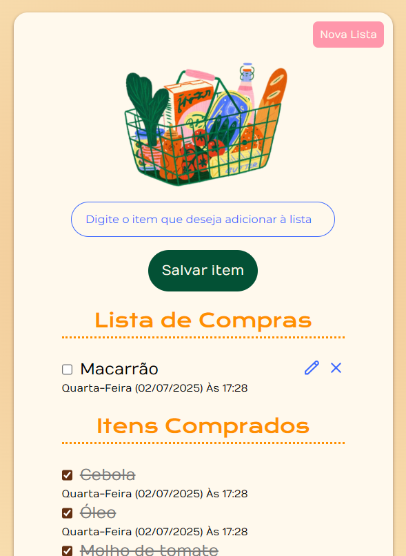

# 🛒 Lista de Compras

Uma lista de compras simples e funcional feita com HTML, CSS E JavaScript, desenvolvida para fins de estudo e aprendizado.

O código inicial foi retirado da aula 01 do curso *JavaScript: construindo páginas dinâmicas* da **Alura**. O CSS foi refeito e o JavaScript complementado.

---

### 📸 Preview

### ✨ Funcionalidades
- Adicionar novos itens;
- Marcar e desmarcar itens como comprados;
- Editar ou excluir itens da lista de compras;
- Separação entre "itens a comprar" e "itens comprados";
- Salvamento automático no navegador (localStorage);
- Botão "Nova Lista" com confirmação antes de apagar tudo;

---

### 🎨 Créditos da imagem
Ilustração por [Marisa Dengate](https://marisadengate.com/).
Imagem usada apenas para fins educacionais, sem fins comerciais.